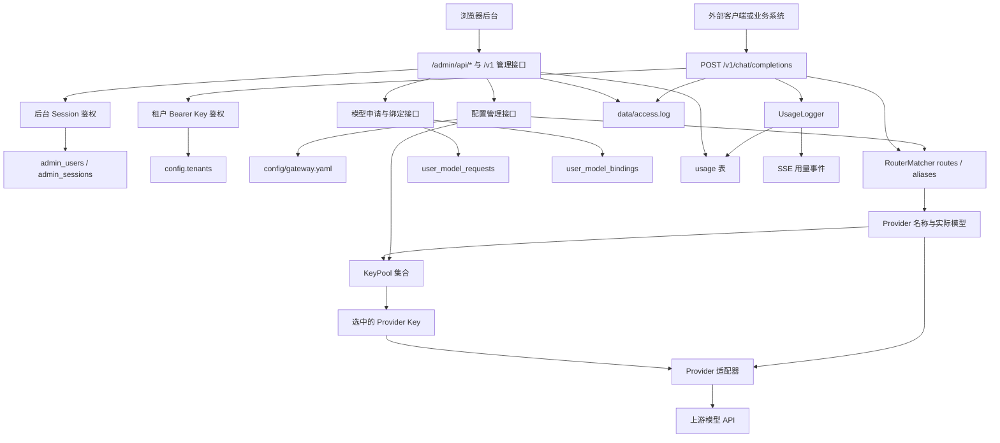
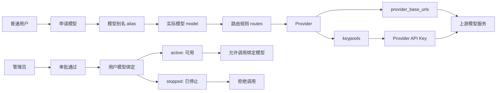
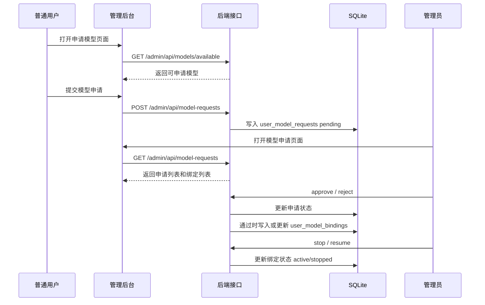
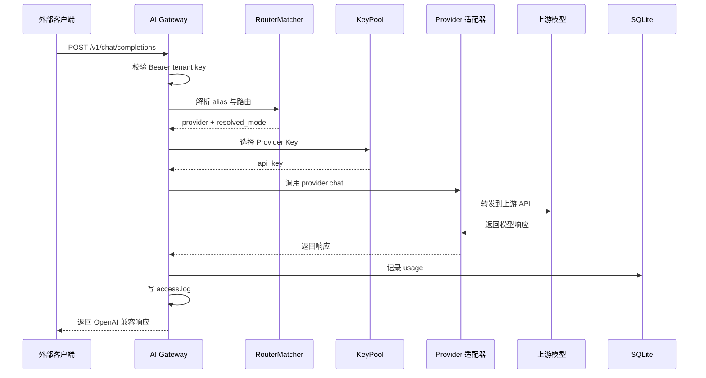

# AI Gateway 中文指南

本文面向项目维护者、管理员和后续开发者，说明 AI Gateway 的功能边界、启动方式、核心模块、模块间调用关系，以及模型从用户申请到实际调用的关系链路。

## 1. 项目定位

AI Gateway 是一个本地部署的多模型 API 代理网关。它对外提供 OpenAI 兼容接口，对内管理多个模型 Provider、模型别名、API Key、用户权限、模型申请、用量统计和请求日志。

当前系统包含两类入口：

- 管理后台：`/admin/`，用于用户、模型、Provider、Key、配置和用量管理。
- 模型调用 API：`/v1/chat/completions`，用于业务系统或客户端调用模型。

## 2. 快速启动

安装依赖：

```powershell
python -m venv .venv
.\.venv\Scripts\Activate.ps1
pip install -e ".[dev]"
```

启动服务：

```powershell
python run.py
```

访问后台：

```text
http://127.0.0.1:8000/admin/login
```

默认管理员：

```text
默认用户名为 `admin`。如果未设置 `ADMIN_PASSWORD`，首次启动会生成随机初始密码并输出到启动控制台。共享环境请务必在首次启动前设置 `ADMIN_PASSWORD`。
```

生产或长期使用前，应通过环境变量修改默认账号密码：

```powershell
$env:ADMIN_USERNAME = "admin@example.com"
$env:ADMIN_PASSWORD = "change-this-password"
python run.py
```

## 3. 核心模块

| 模块 | 作用 |
| --- | --- |
| `app/main.py` | FastAPI 入口，注册 API、后台接口、路由、鉴权、用量记录 |
| `app/config.py` | 读取 `config/gateway.yaml`，解析 Provider、路由、租户、价格等配置 |
| `app/auth/` | 租户 Bearer Key 鉴权和后台登录会话辅助 |
| `app/router/` | 将模型 alias/实际模型名匹配到 Provider |
| `app/keypool/` | Provider Key 池选择、状态标记、轮询/随机/最少使用策略 |
| `app/providers/` | 上游模型 Provider 适配层 |
| `app/db/` | SQLite/SQLAlchemy 数据模型与会话管理 |
| `app/logging/` | 请求日志和用量记录 |
| `app/static/` | 管理后台页面、登录页和前端交互 |
| `config/gateway.yaml` | 网关主配置文件 |

## 4. 模块间调用图



## 5. 模型关系图

一个用户可见的“模型”不是单独字段，而是一条配置链路。链路中任何一环缺失，模型都可能不可申请或不可调用。



示例：

```text
volcengine-code -> ark-code-latest -> route ark-code-latest -> volcengine -> VolcEngine Base URL -> volcengine keypool
```

## 6. 用户模型申请流程



## 7. 模型调用流程



说明：

- 当前外部 API 调用主要使用租户 Bearer Key。
- 用户级 API Key 还未落地，因此外部调用尚不能稳定识别具体注册用户。
- 管理后台用户维度的模型绑定已存在，但要完全约束外部 API 调用，需要后续实现用户级 API Key。

## 8. 配置说明

主配置文件：

```text
config/gateway.yaml
```

关键配置：

```yaml
aliases:
  volcengine-code: ark-code-latest

routes:
  - pattern: ark-code-latest
    provider: volcengine

provider_base_urls:
  volcengine: https://ark.cn-beijing.volces.com/api/coding/v3

keypools:
  volcengine:
    keys:
      - REPLACE_WITH_PROVIDER_KEY
    rate_limit: 60
    strategy: round-robin
```

配置热更新边界：

- 保存配置后会刷新 routes、aliases、keypools。
- 修改租户 Key、限流、配额、Provider Base URL、新 Provider 后端支持时，建议重启服务。

## 9. 数据库

默认数据库：

```text
data/gateway.db
```

数据库类型：

- SQLite
- SQLAlchemy Async ORM
- aiosqlite 驱动

核心表：

| 表 | 说明 |
| --- | --- |
| `admin_users` | 后台用户 |
| `admin_sessions` | 后台登录会话 |
| `admin_user_module_permissions` | 用户模块权限覆盖 |
| `user_model_requests` | 用户模型申请记录 |
| `user_model_bindings` | 用户当前模型绑定 |
| `usage` | 用量记录 |
| `quota_state` | 租户配额状态 |
| `key_state` | Provider Key 状态 |
| `verification_codes` | 注册验证码 |

## 10. 安全注意事项

- 不要把真实 Provider Key 提交到 GitHub。
- 如果真实 Key 曾进入 Git 历史，应立即轮换。
- 生产环境不要使用默认管理员密码。
- 当前验证码接口仍为开发模式，会返回 `debug_code`，不适合公网开放注册。
- `gateway.yaml` 建议本地化保护，生产环境可改为环境变量、secrets 文件或密钥管理服务。
- 请求日志只记录 Key 后缀，不记录完整 Key。
- 管理后台建议放在 VPN、内网、防火墙或可信反向代理后面。

## 11. 当前已知限制

- 用户级 API Key 还未实现，外部调用暂时不能精确绑定到注册用户。
- 配置热更新不完整，部分配置变更需要重启。
- 新增 Provider 向导只写配置，后端还需要注册 Provider 实现。
- 模型可用性展示仍有静态标注成分，后续应改为实时探测。
- 请求日志来自 `data/access.log` 文件，不是数据库查询。
- 操作审计日志尚未实现，后台审批、停用、恢复等操作没有单独审计表。

## 12. 建议下一步

优先级建议：

1. 实现用户级 API Key。
2. 用用户级 API Key 约束外部模型调用。
3. 让 `usage` 表记录 `user_id`、`username`、`api_key_prefix`。
4. 增加操作审计日志。
5. 接入真实邮件/短信验证码。
6. 引入 Alembic 管理数据库迁移。
7. 增加模型实时连通性检测。
